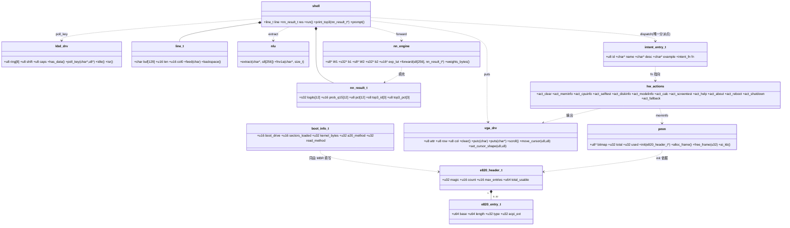

# AIOS v0.1 系统架构设计与任务分解（ARCH）

| 项 | 内容 |
| --- | --- |
| 版本 | v1.0 ｜ 作者：高见远（架构师）｜ 上游：`docs/PRD.md` + 主理人 Q1–Q10 裁决 |
| 状态 | 已定稿，可直接交工程师实施（无需再决策） |
| 目标 | 裸机原生 AI OS：512B MBR 引导层 + i386 freestanding AI 内核层 |

---

## 0. 裁决落地 + 我对 PRD 的 5 条技术复核修正

### 0.1 Q1–Q10 裁决（工程师按此实现）

| # | 裁决 | 落地位置 |
| --- | --- | --- |
| Q1 | 提示符默认 **`{AIOS}> `**；编译期常量 `PROMPT_STYLE`（0=`AIOS> `,1=`{AIOS}> `）一行切回 | `shell/shell.h` |
| Q2 | **优先单体 512B MBR**，先按精简策略争取单片塞下；超限时启用 `TWO_SECTOR`（读盘+进PM 放 LBA1，kernel 顺延 LBA2） | `boot/boot.asm`+`build.py` 自动判定 |
| Q3 | 重启/关机**不二次确认** | `hw/power.c` |
| Q4 | **同时产出** `aios.img`（1.44MB 软盘）+ `aios-hdd.img`（10MB 硬盘含分区表） | `build.py` |
| Q5 | v0.1 全部输出文案 ASCII 英文 | 全工程 |
| Q6 | 指令集 **i386 通用 + CPUID**；禁用 x87/SSE/AVX/MMX/`cmov`；不做 486 无 CPUID 分支 | 编译标志+静态扫描 |
| Q7 | `test.py` 为提交门禁，全绿才算完成 | `test.py` |
| Q8 | 语料**每类 120 条**+OOV 60 条；**纯 Python 手写 SGD，禁 numpy/torch** | `tools/train.py` |
| Q9 | `INTENT_CALC`：两操作数 `+ - * /`、十进制与 `0x`、负数；无括号无优先级 | `hw/calc.c` |
| Q10 | 交付源码+镜像+README+测试；**加分项**：Unicorn 显存 dump 成 HTML/PNG | `tools/dump_vga.py` |

### 0.2 复核修正（R1–R5，以本节为准，覆盖 PRD 冲突处）

| # | PRD 原文 | 复核结论与修正 |
| --- | --- | --- |
| **R1** | FR-B04 E820@`0x8000`；FR-B02 栈在 `0x7C00` 下方；FR-B05 内核@`0x10000` | **三者不冲突**。栈 `0000:7C00` 向下长到 `0x0500`（≈30KB）；E820 表 `0x8000–0x8310`；内核 `0x10000`。新增 **boot info 块 @`0x0500`**（§3.5） |
| **R2** | §6.1 `<W>` 权重"预期 ≈2476" | 2476 是**参数个数**非字节数。按当时形状(64-32-12)实际 = 2048(W1)+128(b1)+384(W2)+48(b2) = 2608 B。**注：v0.1 最终落地形状放大为 256-64-12，权重 ROM = 16384(W1)+256(b1)+768(W2)+48(b2) = `WEIGHTS_BYTES` 17456 B（见 §3.7 与 `nn/config.h`，以后者为准）** |
| **R3** | FR-V04「轮询读 0x64/0x60」+ NFR-04「空闲态 `hlt`」 | **物理冲突**：未建 IDT、IF=0 时 `hlt` 永久停死，IRQ1 唤不醒，真机再也收不到键。修正为双 `KBD_MODE`（§3.4） |
| **R4** | FR-B07「入口符号 `kernel_main` @0x10000」 | 与实测冲突：`--gc-sections` 要求入口必须叫 **`_start`**。改：`ENTRY(_start)`，`_start`@0x10000（8 条指令），其后 `kernel_main` |
| **R5** | FR-T01 `-target i386-freestanding`、`-Wl,-Ttext=` | 实测：`i386-freestanding` 报 unknown architecture；`-Wl,-Ttext=`/`--section-start=`/`--defsym=` 均被拒。统一改 **`-target x86-freestanding`** + **`-Wl,--script=kernel.ld`** + `-Wl,--no-gc-sections`。**全文档生效** |

---

## 1. 实现方案与模块划分

### 1.1 五大挑战与对策

| # | 挑战 | 对策 |
| --- | --- | --- |
| C1 | **446B** 代码区（分区表占 0x1BE–0x1FD）内塞下 A20+E820+读盘+进PM | 精简策略（§8.2），预算 ≈381B，余量 65B；超限自动降级 |
| C2 | 零浮点、零 libc 的整数推理 | int32 累加 + **2 的幂缩放**（移位代替乘法）+ 激活再量化 + Q15 exp LUT（§5） |
| C3 | C/Python 数值**逐位一致** | ①pow2 常量由训练脚本导出 ②Python 写「C 语义整数参考实现」③golden 向量由 Unicorn 比对（§5.5） |
| C4 | Windows 无 nasm/gcc/qemu | keystone 汇编 + `zig cc -target x86-freestanding` + `zig objcopy` + Unicorn 仿真 |
| C5 | Unicorn 无法运行时切 16/32 位 | **两阶段快照移交**（§11.3）；非 boot 用例走 `UC_MODE_32` 捷径 |

### 1.2 架构模式

分层 + **静态表驱动分派**，全局单线程、无堆、无动态分配。L1 一次性线性执行后即死；L2 = `_start → kernel_main → 初始化 → 主循环`。层间唯一耦合是固定地址的 boot info(`0x0500`) 与 E820 表(`0x8000`)。**唯一分派点**是 `shell/dispatch.c: dispatch()`，禁止 if-else 意图链。

### 1.3 目录树与文件职责

| 路径 | 职责 | 行数 |
| --- | --- | --- |
| `build.py` | 8 步流水线总入口（`--slim`/`--two-sector`/`--kbd-mode`/`--dump`） | 300 |
| `test.py` | 测试门禁，≥45 用例分层命名 | 250 |
| `README.md` | 5 分钟上手 + 双镜像写盘命令 + 6 点排错清单 | — |
| `requirements.txt` | ziglang / keystone-engine / capstone / unicorn | 4 |
| `kernel.ld` | `ENTRY(_start)`；`. = 0x10000`；导出 `_bss_start/_bss_end/_kernel_end`；`_pmm_bitmap=0x40000`；`_stack_top=0x90000` | 40 |
| `boot/boot.asm` | L1 MBR 源（keystone Intel 语法，16 位），代码区 ≤446B | 230 |
| `core/types.h` | `u8..u64/s8..s64/size_t/NULL/PACKED/STATIC_ASSERT` 自 typedef | 30 |
| `core/io.h` | `inb/outb/inw/outw/io_wait` 静态内联 | 30 |
| `core/string.h/.c` | `memcpy/memset/memmove/memcmp/strlen/strcmp/strncmp/strcpy/strncpy/strchr/u32_to_dec/s32_to_dec/u32_to_hex/u64_to_hex/to_lower/...` | 150 |
| `core/div.c` | `__udivsi3` / `__umodsi3` 手写（防链接器找 libc） | 40 |
| `core/start.c` | `_start`：设 `ESP=0x90000` → 清 `.bss` → `kernel_main()` → `hlt` 兜底 | 50 |
| `core/idt.c`+`pic.c` | 仅 `KBD_MODE=1` 编译：IDT 2 门 + PIC 重映射 0x20–0x2F，只 unmask IRQ1 | 110 |
| `core/globals.c` | 跨模块静态缓冲 + 首尾 canary `0xCAFEBABE`/`0xDEADBEEF` | 40 |
| `core/banner.c` | 启动画面 11 行 golden fixture（PRD §6.1） | 70 |
| `drivers/vga.h/.c` | 0xB8000 文本驱动 + CRTC 硬件光标 + 滚动 | 190 |
| `drivers/kbd.h/.c` | PS/2 Set1 双表 + Shift/Caps/LED + 环形缓冲（KBD_MODE=1） | 210 |
| `mm/e820.h` | `e820_header_t`/`e820_entry_t`/`boot_info_t` + sizeof 静态断言 | 40 |
| `mm/pmm.h/.c` | 4KB 帧位图分配器 @`0x40000` | 130 |
| `nn/config.h` | `NN_IN/HID/OUT` + 五移位常量 + `WEIGHTS_BYTES` + static_assert（**生成**） | 50 |
| `nn/model_weights.h` | `W1q[256][64] b1q[64] W2q[64][12] b2q[12] exp_lut_q15[513]`（**生成**） | 生成 |
| `nn/nn.h/.c` | int8 MLP 前向 + 定点 softmax + Top-3 | 160 |
| `nlu/nlu.h/.c` | 归一化→分词→unigram/bigram/trigram + 字符 trigram→FNV-1a→`NLU_DIM`(256) 维 int8 计数特征 | 120 |
| `shell/intent.h` | `INTENT_*` 枚举（13 项含 FALLBACK） | 25 |
| `shell/shell.h/.c` | 行编辑器 + 主循环 + 提示符 + Top-3 打印 | 170 |
| `shell/dispatch.h/.c` | VTable 13 项 + `dispatch()` 唯一分派点 | 80 |
| `hw/hw.h` | 动作统一签名 `void (*)(const char*, const nn_result_t*)` | 20 |
| `hw/cpuinfo.c` | CPUID leaf 0/1/0x80000002-4 | 110 |
| `hw/selftest.c` | PCI 0xCF8/0xCFC 扫描 + 1MB march + CMOS/RTC | 160 |
| `hw/diskinfo.c` | ATA PIO identify 0x1F0/0x170，30s 计数超时，结果缓存 | 130 |
| `hw/calc.c` | 两操作数整数四则（十进制+0x+负数），除零 `error: divide by zero` | 100 |
| `hw/screentest.c` | 16 色带 / 棋盘格 / 字符雾化渐变，任意键退出 | 100 |
| `hw/meminfo.c` | E820 汇总 + PMM 统计 + AI 占比（含 `act_clear`） | 80 |
| `hw/modelinfo.c` | 五项字段：形状/位宽/ROM 地址/字节数/AI 独占 | 60 |
| `hw/help_about.c` | HELP 13 行 / ABOUT 5 行 golden | 60 |
| `hw/power.c` | 8042 `0x64←0xFE`；APM→ACPI `0x604←0x2000`→`hlt` 三分支 | 80 |
| `tools/gen_corpus.py` | 13 类×120 条 + OOV 60；扰动算子 5 种；`seed=20260101` | 190 |
| `tools/train.py` | 纯 Python SGD + 量化标定十步 + `ref_forward` + 导出四件 | 280 |
| `tools/asm_boot.py` | keystone 封装 + 512B 断言 + 字节预算报告 | 70 |
| `tools/elfinfo.py` | 手写 ELF32 解析：未定义符号扫描（替代 `nm`，零依赖） | 130 |
| `tools/scan_instr.py` | capstone 反汇编 `kernel.bin`@0x10000，浮点/SIMD 黑名单 | 90 |
| `tools/dump_vga.py` | 显存 → `screen.html`（必做）/ `screen.png`（可选，内置 zlib） | 140 |
| `tools/unicorn_bridge.py` | BIOS 桩 + 端口桩 + 两阶段快照 | 320 |
| `tools/golden_features.json` | 200 条语料 → `NLU_DIM`(256) 字节特征 hex（**生成**） | — |
| `tools/golden_vectors.json` | 20 条特征 → logits[12]/Top-3（**生成**） | — |

**代码量**：C ≈2,300 行；Python ≈1,500 行；汇编 ≈230 行。

---

## 2. 内存布局（最终版）

```
 物理地址          区域                              尺寸     归属       说明
 ────────────────────────────────────────────────────────────────────────────────
 0x00000000 ┌─ IVT                                  1 KB    BIOS       不用
 0x00000400 ├─ BDA                                  256 B   BIOS       不用
 0x00000500 ├─ ★ BOOT INFO 块                       16 B    MBR→内核   §3.5
 0x00000510 ├─ 实模式空闲                           ~30 KB  —
 0x00007C00 ├─ ★ MBR 代码                           512 B   L1         BIOS 载入
      ◄─────┤    SS:SP = 0000:7C00，栈向下生长
 0x00007E00 ├─ 实模式空闲
 0x00008000 ├─ ★ E820 头（16B）+ 条目[0..31] @24B   784 B   MBR→内核   0x8010 起条目
 0x00008310 ├─ 空闲
 0x00010000 ├─ ★ 内核 .text @0x10000（_start 首字节）~40 KB L2
            │      .rodata / .data / .bss 紧随
 0x0001A000 ├─ 内核结束（动态，build.py 打印）
 ───────────┼───────────────────────────────────────────────────────────────────
 0x00040000 ├─ ★ PMM 位图（编译期固定）             ≤128 KB mm         管理上限 4GB
 0x00060000 ├─ ★ AI 引擎专属竞技场                  128 KB  nn         激活/工作区
 0x00080000 ├─ 内核栈保护间隙
 0x00090000 ├─ ★ 内核栈顶（ESP 初值，向下生长）
 0x000A0000 ├─ VGA 图形 / EBDA 保留                 —      —          不触碰
 0x000B8000 ├─ ★ VGA 文本显存 80×25×2               4000 B drivers     0xB8000–0xB8F9F
 0x00100000 ┴─ ★ 1MB 分界：以下 256 帧由 PMM 全标「已占用」
 ────────────────────────────────────────────────────────────────────────────────
 0x00100000 ┌─ PMM 可分配区（E820 Type==1 且 base ≥1MB），4KB 帧，1 bit/帧
   mem_top  └─
```

### 2.1 硬约束（工程师必读）

1. **PMM 位图固定 @`0x40000`，不放 `.bss`** —— 否则 `objcopy -O binary` 为 NOBITS 填零，把 `kernel.bin` 撑到几百 KB，软盘装不下。用指针访问：`static u8 *const PMM_BITMAP = (u8*)0x40000;`
2. **AI 竞技场 `0x60000–0x80000`** 同样在 bin 外，供 `INTENT_MODELINFO` 报告「AI 独占」。
3. **`pmm_init` 把 1MB 以下 256 帧全标已用** → 空闲态 `pmm_used` ≈内核bin+栈+位图+VGA ≈200KB，满足 FR-M03「≤256KB」且「AI 占比 ≥90%」。
4. 内核 bin ≤448KB（NFR-01 目标 ≤128KB，>128KB 告警）。
5. **禁止 u64 变量移位与除法**（会引入 `__ashldi3`/`__udivdi3`）；E820 打印用常量移位 + 32 位切片 + **十六进制**。

---

## 3. 数据结构与接口（C 头文件级）

### 3.1 `core/types.h` —— 自 typedef（**禁止** `#include <stdint.h>/<stddef.h>/<string.h>`）

```c
typedef unsigned char u8;      typedef signed char   s8;
typedef unsigned short u16;    typedef signed short  s16;
typedef unsigned int u32;      typedef signed int    s32;
typedef unsigned long long u64;typedef signed long long s64;
typedef unsigned int size_t;
#define NULL ((void*)0)
#define PACKED __attribute__((packed))
#define STATIC_ASSERT(c,m) _Static_assert(c,m)
```

### 3.2 `core/io.h`

```c
static inline u8  inb(u16 p);  static inline u16 inw(u16 p);
static inline void outb(u16 p, u8 v); static inline void outw(u16 p, u16 v);
static inline void io_wait(void);      /* outb(0x80, 0) */
```

### 3.3 `drivers/vga.h`

```c
#define VGA_BASE ((u16*)0xB8000)  #define VGA_W 80   #define VGA_H 25
#define VGA_SIZE (VGA_W*VGA_H*2)  #define CRTC_ADDR 0x3D4  #define CRTC_DATA 0x3D5

/* 属性字节（PRD §6.5） */
#define ATTR_DEFAULT 0x07  /* 浅灰 */   #define ATTR_BOOT 0x09  /* [boot] 亮蓝 */
#define ATTR_KERN    0x0D  /* [kern] 亮品红 */ #define ATTR_PROMPT 0x0F /* 提示符 高亮白 */
#define ATTR_INPUT   0x0E  /* 用户输入 亮黄 */ #define ATTR_AI   0x0A  /* AI 响应 亮绿 */
#define ATTR_META    0x0B  /* AI:(NN%) 亮青 */ #define ATTR_TITLE 0x0E /* 表头 */
#define ATTR_ERR     0x04  /* 错误 红 */       #define ATTR_HINT 0x08  /* 兜底建议 深灰 */

void vga_init(void);                    /* 清屏 + 一次性设置硬件闪烁光标 */
void vga_clear(void);                   /* 全屏 [0x20,ATTR_DEFAULT] + 光标归 (0,0) */
void vga_set_attr(u8 a);  u8 vga_get_attr(void);
void vga_putc(char c);                  /* 处理 \n \r \t \b 与第 25 行滚动 */
void vga_puts(const char *s); void vga_puts_attr(const char *s, u8 a);
void vga_putn(const char *s, size_t n);
void vga_scroll(void);                  /* memmove 3840B + 末行填空格 */
void vga_move_cursor(u8 x, u8 y);       /* CRTC 0x0E/0x0F */
void vga_set_cursor_shape(u8 s, u8 e);  /* CRTC 0x0A/0x0B */
void vga_hide_cursor(void);             /* CRTC 0x0A <- 0x20 */
u8 vga_row(void); u8 vga_col(void);
```

**硬件光标闪烁（采纳 FR-V03）**：`vga_init` 里一次性写 `0x3D4←0x0A,0x3D5←0x0D`；`0x3D4←0x0B,0x3D5←0x0E`。此后闪烁完全由 VGA CRTC 硬件完成，**源码中禁止出现任何软件定时器翻光标**（`test.py` 有 grep 用例）。

### 3.4 `drivers/kbd.h` —— 双模式（架构修正 R3）

```c
#define KBD_RING_SIZE 8
/* KBD_MODE=0（默认，Unicorn 测试用）：纯轮询，无 IDT，无 hlt
 * KBD_MODE=1（真机默认）：最小 IDT + 仅 IRQ1 + sti;hlt            */
int  kbd_init(void);
int  kbd_has_data(void);                       /* inb(0x64) & 0x01 */
u8   kbd_read_sc(void);                        /* inb(0x60) */
int  kbd_poll_key(char *out_ascii, u8 *out_raw);  /* 0=无键 1=有键 */
void kbd_idle(void);                           /* MODE=1: sti;hlt ／ MODE=0: 空 */
void kbd_set_leds(u8 mask);                    /* 0x60<-0xED, <-mask */

#define LINE_MAX 128
typedef struct { char buf[LINE_MAX+1]; u16 len; u16 col0; } line_t;
void line_init(line_t *l, u16 start_col);
int  line_feed(line_t *l, char c);             /* 满返回 -1（不回显） */
int  line_backspace(line_t *l);                /* 到 col0 返回 0（不动） */
```

**轮询 + `hlt` 不丢键的机制（KBD_MODE=1）**
1. IDT 只装 2 门：`vec 0x21`(IRQ1)→`kbd_isr`，其余→哑 `isr_stub`。PIC 重映射 IRQ0–15→0x20–0x2F，`IMR` 只 unmask IRQ1。
2. `kbd_isr` 仅 4 步：`sc=inb(0x60); ring_push(sc); outb(0x20,0x20); iret;` —— 不解码不打屏，<30 条指令。
3. 主循环 `while(!kbd_has_data() && ring_empty()) kbd_idle();`（`sti;hlt`）；IRQ1 唤醒后从 `hlt` 下一条继续，环形缓冲字节不丢。
4. 消费临界区 `cli; c=ring_pop(); sti;`（4 条指令），单线程下一致。
5. 环满（8 槽）丢弃并置 `g_kbd_overflow`。**Unicorn 测试一律 `KBD_MODE=0`**，与真机共用 `kbd_poll_key` 以上全部逻辑，覆盖等价。

### 3.5 `mm/e820.h` —— MBR↔内核 ABI（布局必须逐字节一致）

```c
#define E820_MAGIC 0x30323845u   /* 'E','8','2','0' 小端 */
#define E820_HDR_ADDR 0x8000u    #define E820_ENT_ADDR 0x8010u
#define E820_MAX_ENTRIES 32      #define E820_ENTRY_SIZE 24
#define BOOT_INFO_ADDR 0x0500u

typedef struct PACKED { u64 base; u64 length; u32 type; u32 acpi_ext; } e820_entry_t;
typedef struct PACKED { u32 magic; u16 count; u16 max_entries; u64 total_usable; } e820_header_t;
typedef struct PACKED {
    u16 boot_drive; u16 sectors_loaded; u32 kernel_bytes;
    u32 a20_method;   /* 1=INT15h2401 2=port0x92 3=8042 0=失败 */
    u32 read_method;  /* 1=INT13h AH=42(LBA) 2=AH=02(CHS) */
    u32 reserved;
} boot_info_t;        /* 16B @0x0500 */
STATIC_ASSERT(sizeof(e820_entry_t)==24, "e820 entry ABI");
STATIC_ASSERT(sizeof(boot_info_t)==16,  "boot info ABI");
```

### 3.6 `mm/pmm.h`

```c
#define PMM_FRAME_SIZE 4096u         #define PMM_BITMAP_ADDR 0x40000u
#define PMM_BITMAP_MAX_BYTES (128*1024u)
#define PMM_AI_ARENA_ADDR 0x60000u   #define PMM_AI_ARENA_BYTES (128*1024u)
void pmm_init(const e820_header_t *hdr);   /* 建位图；1MB 以下全标已用 */
u32 pmm_alloc_frame(void);                 /* 返回物理地址，0=OOM */
void pmm_free_frame(u32 addr);
u32 pmm_total_frames(void); u32 pmm_used_frames(void);
u32 pmm_total_kb(void);     u32 pmm_used_kb(void);    u32 pmm_ai_kb(void);
size_t pmm_bitmap_bytes(void);
```

### 3.7 `nlu/nlu.h` ｜ `nn/config.h` ｜ `nn/nn.h`

```c
#define NLU_DIM 256  #define NLU_MAX_CHARS 128
#define NLU_MAX_TOKENS 32  #define NLU_MAX_TOKEN_LEN 31
#define NLU_USE_BIGRAM 1
void nlu_extract(const char *line, s8 feat[NLU_DIM]);
u32  nlu_fnv1a(const char *s, size_t n);           /* 单独暴露便于测试 */

/* —— nn/config.h 由 tools/train.py 生成，禁止手改 —— */
#define NN_IN 256  #define NN_HID 64  #define NN_OUT 12
#define W1_SHIFT 7        /* k1 */
#define ACT1_SHIFT 3      /* r1 */
#define W2_SHIFT 5        /* k2 */
#define OUT_SHIFT 9       /* = k1+k2-r1，logits 定点小数位 */
#define LUT_SHIFT 4       /* exp LUT 输入步长 2^-4 */
#define SOFT_IDX_SHIFT (OUT_SHIFT - LUT_SHIFT)   /* = 5 */
#define D_MAX (511u << SOFT_IDX_SHIFT)           /* = 16352 */
#define NN_LUT_ENTRIES 513
#define CONF_THRESHOLD 35     /* Top-1 <35% → INTENT_FALLBACK */
#define WEIGHTS_BYTES 17456u  /* 修正 R2：见下注；16384(W1)+256(b1)+768(W2)+48(b2) */

typedef struct {
    s32 logits[12]; u16 prob_q15[12]; u8 pct[12];
    s8 top3_id[3];  u8  top3_pct[3];  u8 top1;
} nn_result_t;
void nn_forward(const s8 x[NLU_DIM], nn_result_t *out);   /* 全整数，零浮点 */
const s8 *nn_weights_w1(void); size_t nn_weights_bytes(void);
```

**特征类型（四类，共享同一个 `s32 acc[NLU_DIM]` 累加向量）**：token unigram、
token bigram、**token trigram**、**字符级 trigram**。字符级 trigram 先 strip 掉
归一化文本的首尾空格，再在其上以 3 字符滑动窗口取样（内部空格参与），是对拼写错误
鲁棒的关键——它让"大小写 / 标点 / 多空格 / 错字"这些变体收敛到同一个特征向量
（严格定义与不变性验收见 §6）。

### 3.8 `shell/dispatch.h` —— VTable（禁 if-else 链）

```c
typedef void (*intent_fn)(const char *line, const nn_result_t *r);
typedef struct { u8 id; const char *name; const char *desc;
                 const char *example; intent_fn fn; } intent_entry_t;
extern const intent_entry_t INTENT_TABLE[13];
#define INTENT_COUNT 13
void dispatch(u8 id, const char *line, const nn_result_t *r);  /* 唯一分派点 */
```

### 3.9 关键结构关系图



---

## 4. 程序调用流程（时序图）

```mermaid
sequenceDiagram
    autonumber
    participant BIOS as BIOS/UEFI-CSM
    participant MBR as L1 MBR@0x7C00
    participant KS as L2 kernel@0x10000
    participant VGA as VGA 0xB8000+CRTC
    participant KBD as PS/2 0x64/0x60
    participant NLU as nlu_extract
    participant NN as nn_forward
    participant DSP as dispatch VTable
    participant HW as hw 动作
    BIOS->>MBR: POST 完成，INT19h 读 LBA0 → 0x7C00，DL=驱动器
    MBR->>MBR: cli / 段寄存器归零 / SS:SP=0000:7C00 / 存 DL
    MBR->>MBR: A20 开启（INT15h AX=2401 → 0x92 → 8042）
    MBR->>BIOS: INT 15h AX=E820，BX 连续迭代
    BIOS-->>MBR: 每条 24B 写入 0x8010..，CF=1 结束
    MBR->>MBR: 写 E820 头@0x8000 + boot_info@0x0500
    MBR->>BIOS: INT 13h AH=41 探测扩展 → AH=42 逐扇区读到 0x10000
    Note over MBR: 不支持则回退 CHS AH=02（可裁剪）
    MBR->>MBR: lgdt / CR0.PE=1 / jmp 0x08:0x10000
    MBR->>KS: 控制权移交（32 位保护模式）
    KS->>KS: _start：ESP=0x90000，清 .bss，调 kernel_main
    KS->>VGA: vga_init（清屏 + CRTC 0x0A/0x0B 设闪烁光标）
    KS->>VGA: banner：11 行启动画面（[boot] 蓝 / [kern] 品红）
    KS->>KS: pmm_init(0x8000)：建位图@0x40000，1MB 以下标已用
    KS->>KS: kbd_init（KBD_MODE=1 时装 IDT+PIC，仅 IRQ1）
    KS->>VGA: [kern] int8 mlp 256-64-12 online, 17456 bytes of weights in rom
    KS->>VGA: "{AIOS}> "（ATTR_PROMPT）
    loop 主循环
        KS->>KBD: kbd_has_data / ring 非空？
        alt 无键
            KS->>KS: kbd_idle()（MODE=1: sti;hlt）
        else 有键
            KBD->>KS: scancode（ISR 入环 或 轮询读取）
            KS->>VGA: 行编辑器回显（ATTR_INPUT）
            KS->>KS: Enter → 提交行
            alt 空行
                KS->>VGA: 换行 + 重打提示符
            else 非空
                KS->>NLU: nlu_extract(line, feat[256])
                NLU-->>KS: 256 维 int8 特征
                KS->>NN: nn_forward(feat, &res)
                NN-->>KS: logits / Top-3 / pct
                KS->>VGA: "AI: <intent> (NN%)" + ".. " ×2（ATTR_META）
                KS->>DSP: dispatch(res.top1, line, &res)
                DSP->>HW: INTENT_TABLE[id].fn(line, r)
                HW->>VGA: 硬件动作输出（ATTR_AI）
                KS->>VGA: 换行 + 重打提示符
            end
        end
    end
```

---

## 5. 推理引擎：int8 定点 MLP（零浮点）

### 5.1 网络与量化域

```
输入   x[256]     int8 有符号计数特征，[-127,127]，真实值 = x
L1     acc1[i] = b1q[i] + Σ_{j=0..255} W1q[j][i] * x[j]         int32 累加（i=0..63）
       a1[i]   = min(127, max(0, acc1[i]) >> ACT1_SHIFT)         激活再量化
L2     acc2[c] = b2q[c] + Σ_{i=0..63} W2q[i][c] * a1[i]          int32 累加（c=0..11）
       logit[c]= acc2[c]                                         定点 Q(OUT_SHIFT)
```

即 **256 → 64 (ReLU) → 12**：`W1q[256][64]`、`b1q[64]`、`W2q[64][12]`、`b2q[12]`。
单次前向 ≈ 256×64 + 64×12 = **17,152 次 MAC**，全部 int32 累加，无浮点。

| 量 | 量化式（Python 侧） | C 侧还原 |
| --- | --- | --- |
| `W1q[j][i]` | `clamp(round_half_up(W1 * 2^k1), -127, 127)` | `W1 = W1q * 2^-k1` |
| `b1q[i]` | `round_half_up(b1 * 2^k1)`（int32） | `b1 = b1q * 2^-k1` |
| `a1[i]` | `min(127, max(0,acc1) >> r1)` | `a1_real = a1 * 2^(r1-k1)` |
| `W2q[i][c]` | `clamp(round_half_up(W2 * 2^k2), -127, 127)` | `W2 = W2q * 2^-k2` |
| `b2q[c]` | `round_half_up(b2 * 2^OUT_SHIFT)`（int32） | `b2 = b2q * 2^-OUT_SHIFT` |
| `logit[c]` | `= acc2[c]` | `logit_real = logit * 2^-OUT_SHIFT` |

**`OUT_SHIFT = k1 + k2 - r1`**，由训练脚本算出写入 `nn/config.h`。

### 5.2 溢出安全边界（可静态证明）

`|acc1| ≤ 256×127×127 + |b1q| = 4,129,024 + |b1q|`；`|acc2| ≤ 64×127×127 + |b2q| = 1,032,256 + |b2q|`；均 ≪ 2³¹。特征累加用 `s32 acc[NLU_DIM]`（256 槽），最后统一 clamp。

**跨语言逐位一致的第一性保证**：所有移位操作的被移位量在移位前**均为非负**（`acc1` 过 ReLU 后非负；softmax 的 `d` 为 `max−logit` 非负），故 C 的算术右移 ≡ 数学 floor，**Python `>>` 与 C `>>` 结果完全相同**。

### 5.3 定点 softmax（int16 exp LUT，Q15）

```c
s32 m = logits[0]; for (c=1;c<12;c++) if (logits[c] > m) m = logits[c];
u32 sum = 0;
for (c = 0; c < 12; c++) {
    u32 d = (u32)(m - logits[c]);            /* Q(OUT_SHIFT)，恒 ≥0 */
    if (d > D_MAX) d = D_MAX;                /* 饱和：e^-31.9 ≈ 0 */
    u32 idx = d >> SOFT_IDX_SHIFT;           /* 0..511，步长 2^-LUT_SHIFT；LUT 共 513 项 */
    u16 e = exp_lut_q15[idx];
    prob_q15[c] = e;  sum += e;
}
for (c = 0; c < 12; c++)  pct[c] = (u8)(((u32)prob_q15[c]*100u + sum/2u) / sum);
/* Top-3：三轮线性 argmax，禁 qsort、禁浮点 */
```

- LUT（Python 生成，`NN_LUT_ENTRIES = 513`）：`exp_lut_q15[i] = min(65535, round_half_up(math.exp(-i * 2**-4) * 32768))`，`i∈[0,513)`；`i=0`→32768，合法 uint16。实际索引上界 511（`D_MAX >> SOFT_IDX_SHIFT`），多出的 2 项留作 P1 一阶插值读 `idx+1` 时不越界。
- `sum` 上界 12×32768 = 393,216（uint32 安全）；`e*100` 上界 3,276,800（安全）。
- 精度：步长 1/16 → 单值相对误差 ≤3%，百分比偏差 <1pp，满足 FR-N03「≤2pp」。
- **可选优化（P1）**：LUT 一阶线性插值（用 `idx` 余数），精度 <0.2pp，不改结构。

### 5.4 训练脚本常量标定十步（`tools/train.py`，务必按序）

```
 1. 纯 Python float SGD 训练 MLP(256-64-ReLU-12)，固定种子，交叉熵 + L2
 2. k1 = floor(log2(127 / max|W1|))                    → W1q, b1q
 3. 全训练集算 acc1 → max_a1 = max(max(0, acc1))
    r1 = max(0, ceil(log2(max_a1 / 127)))
 4. k2 = floor(log2(127 / max|W2|))                    → W2q
 5. OUT_SHIFT = k1 + k2 - r1
    OUT_SHIFT <  8 → 减小 r1（L2 上界 1,032,256，r1 可减到 0）
    OUT_SHIFT > 14 → 增大 r1
 6. b2q = round_half_up(b2 * 2^OUT_SHIFT)
 7. 整数参考实现 ref_forward(feat) 跑验证集 → Top-1 / Top-3
 8. 与 float 版对账：Top-1 一致率 ≥99%；否则加训/加语料/调 lr，**不调常量**
 9. 断言 top1 ≥0.95 且 perturb_top1 ≥0.85（FR-N08），否则构建失败
10. 导出 nn/model_weights.h + nn/config.h + golden_vectors.json + golden_features.json
    + build/train_report.json
```

**取整规范（唯一，禁止 banker's rounding）**：
```python
def round_half_up(x):  return int(x + 0.5) if x >= 0 else -int(-x + 0.5)
```

### 5.5 数值一致性三层闸门

| 层 | 验证内容 | 工具 | 失败判定 |
| --- | --- | --- | --- |
| L1 特征 | 200 条语料：Python 参考特征 vs Unicorn 跑 `nlu_extract` 读回的 `NLU_DIM`(256) 字节 | `golden_features.json` | 异 → `layer=nlu` FAIL |
| L2 前向 | 20 条特征：Python `ref_forward` vs Unicorn 跑 `nn_forward` 读回的 `logits[12]` | `golden_vectors.json` | 异 → `layer=nn` FAIL |
| L3 端到端 | 13 类说法敲进 Unicorn，断言屏幕出现期望 `AI: <intent> (` | `test.py` | 未出现 → `layer=dispatch` FAIL |

> **注意**：`ref_forward` 必须用 **Python 整数**复刻 C 的**移位/饱和/求和顺序**，不得用 float；C 侧中间量一律 `s32`（禁 int16）；**缩放一律移位，禁用除法**。

---

## 6. 特征抽取确定性规范（严格 7 步，顺序不可交换）

1. **截断**：取 `line` 到首个 `'\0'`，硬上限 `NLU_MAX_CHARS` = 128。
2. **归一化**（单遍扫描写入 `norm[128]`）：
   a. `'A'≤c≤'Z'` → `c += 32`（**先于任何判定**）；
   b. `alnum = ('a'≤c≤'z') || ('0'≤c≤'9')`；非 alnum 一律视为分隔符 → 写 `' '`；
   c. 折叠连续分隔符：仅当 `norm` 末尾非空格才写空格；**不做 trim**（由分词器忽略空 token）。
3. **分词**：按 `' '` 切分；token 数上限 32；单 token 超 31 字符则**截断**（不丢弃）。
4. **N-gram 展开**（四类，**先后顺序不可交换**）：
   a. **token unigram**：`tok[i]`，数量 `n`；
   b. **token bigram**：`"tok[i] + ' ' + tok[i+1]"`（中间**恰好一个空格**），数量 `min(n-1, 31)`；`NLU_USE_BIGRAM=1` 启用；
   c. **token trigram**：`"tok[i] + ' ' + tok[i+1] + ' ' + tok[i+2]"`（中间各**恰好一个空格**），
      数量 `n - 2`（`ntok ≤ 32`，故最多 30；不做额外截断）；
   d. **字符级 trigram**：先把 `norm` 的**首尾空格 strip 掉**（等价于 Python `norm.strip()`，
      这是 FR-N01「前导/尾随空格不变性」的必要条件），再在剩余区间上以 3 字符窗口滑动，
      **内部空格参与**，数量 `(e - s) - 2`。
      —— 这一类是**对拼写错误鲁棒的关键**：它不看词边界，因此 `memroy` / `memory`、
      `screen` / `screeen` 这类错字仍会与正确写法共享大部分字符窗口，使向量收敛。
5. **Hashing（FNV-1a 32 位，逐字节）**：
   ```
   h = 0x811C9DC5
   for b in ngram:  h = (h ^ b) & 0xFFFFFFFF;  h = (h * 0x01000193) & 0xFFFFFFFF
   ```
   C 侧 `u32` 自然回绕；Python 侧每次 `& 0xFFFFFFFF`。
6. **有符号计数累加**（`s32 acc[NLU_DIM]` 初值 0；unigram/bigram/trigram/字符 trigram
   **四类共享同一向量**）：
   `idx = h & (NLU_DIM - 1)`；`sign = (h >> 6) & 1`；`acc[idx] += (sign ? -1 : +1)`。
   —— `NLU_DIM` 恒为 2 的幂（当前 256），故取桶用掩码而非取模，**不引入除法**。
7. **统一 clamp（最后一步，禁止边加边裁剪）**：`feat[i] = clamp(acc[i], -127, 127)` → `s8`。

**一致性验收（FR-N01）**：同一句话的「全大写 / 全小写 / 混合大小写 / 尾随 `!?.` / 多空格 / 前导空格」六种变体，产生的 `NLU_DIM`(256) 字节必须**逐字节相同**。

---

## 7. 意图分派表（VTable）

```c
/* shell/dispatch.c —— 数组顺序必须与 intent.h 枚举严格一致 */
const intent_entry_t INTENT_TABLE[INTENT_COUNT] = {
 {INTENT_CLEAR,     "INTENT_CLEAR",     "clear the screen",         "clear the screen",          act_clear},
 {INTENT_MEMINFO,   "INTENT_MEMINFO",   "e820 map and allocator",   "tell me about my memory",   act_meminfo},
 {INTENT_CPUINFO,   "INTENT_CPUINFO",   "cpuid vendor/brand",       "what cpu is this",          act_cpuinfo},
 {INTENT_SELFTEST,  "INTENT_SELFTEST",  "pci scan, mem march, rtc", "run a hardware self test",  act_selftest},
 {INTENT_DISKINFO,  "INTENT_DISKINFO",  "ata identify",             "is there a disk installed", act_diskinfo},
 {INTENT_MODELINFO, "INTENT_MODELINFO", "shape, bit width, rom",    "what model are you using",  act_modelinfo},
 {INTENT_CALC,      "INTENT_CALC",      "integer calculator",       "what is 12 times 7",        act_calc},
 {INTENT_SCREENTEST,"INTENT_SCREENTEST","color and pattern test",   "test the screen",           act_screentest},
 {INTENT_HELP,      "INTENT_HELP",      "-",                        "help",                      act_help},
 {INTENT_ABOUT,     "INTENT_ABOUT",     "-",                        "who are you",               act_about},
 {INTENT_REBOOT,    "INTENT_REBOOT",    "hardware reset",           "reboot",                    act_reboot},
 {INTENT_SHUTDOWN,  "INTENT_SHUTDOWN",  "power off",                "shutdown",                  act_shutdown},
 {INTENT_FALLBACK,  "INTENT_FALLBACK",  "unknown intent",           "-",                         act_fallback},
};
void dispatch(u8 id, const char *line, const nn_result_t *r) {
    if (id >= INTENT_COUNT) id = INTENT_FALLBACK;
    INTENT_TABLE[id].fn(line, r);
}
```

**强制约束**：对 13 项各写一行 `STATIC_ASSERT(INTENT_TABLE[INTENT_X].id == INTENT_X)`；`STATIC_ASSERT(INTENT_COUNT==13)`。全工程**唯一**允许的意图 if 语句是 `shell.c` 提交处的 `if (top1_pct < CONF_THRESHOLD) id = INTENT_FALLBACK;`，其余位置禁止 `strcmp(intent_name, ...)`。

---

## 8. 引导层（L1）伪代码与 512B 预算

### 8.1 MBR 全流程伪代码（keystone Intel 语法）

```
start:      cli; xor ax,ax; mov ds,ax; mov es,ax; mov ss,ax; mov sp,0x7C00
            mov [BI.boot_drive], dl; sti
a20_bios:   mov ax,0x2401; int 0x15; jnc a20_ok          ; 第一路
a20_fast:   in al,0x92; or al,0x02; and al,0xFE; out 0x92,al   ; 第二路，不回读校验省字节
a20_8042:   call kbc_wait_in;  mov al,0xAD; out 0x64,al  ; 第三路（精简，无冗长错误打印）
            call kbc_wait_in;  mov al,0xD0; out 0x64,al
            call kbc_wait_out; in al,0x60; or al,0x02; push ax
            call kbc_wait_in;  mov al,0xD1; out 0x64,al
            call kbc_wait_in;  pop ax; out 0x60,al
a20_ok:     mov [BI.a20_method], <method>
e820:       mov di,0x8010; xor ebx,ebx; xor bp,bp
.again:     mov eax,0xE820; mov ecx,24; mov edx,0x534D4150
            mov [di+20], dword 1; int 0x15; jc .done
            cmp eax,0x534D4150; jne .done
            add [TOT_LO],[di]; adc [TOT_HI],[di+4]      ; 仅累加 type==1
            inc bp; add di,24; cmp bp,32; je .done
            test ebx,ebx; jnz .again
.done:      mov [0x8000],dword 0x30323845; mov [0x8004],bp; mov [0x8006],word 32
read:       mov ah,0x41; mov bx,0x55AA; int 0x13; jc .chs
            cmp bx,0xAA55; jne .chs
.lba:       mov si,dap; mov ah,0x42; mov dl,[BI.boot_drive]; int 0x13
            jc disk_error; jmp short to_pm
.chs:       << LBA→CHS 换算 + AH=02 循环，ES 段推进 >>    ; 可裁剪，省 ~52B
disk_error: mov si,err_str; call print_str16; jmp hang
to_pm:      cli; lgdt [gdtr]; mov eax,cr0; or al,1; mov cr0,eax
            jmp 0x08:0x10000                             ; 远跳转到 _start
hang:       hlt; jmp hang
; ── 尾部数据区（0x1A0 之后）──
kbc_wait_in:  in al,0x64; test al,0x02; jnz kbc_wait_in; ret
kbc_wait_out: in al,0x64; test al,0x01; jz  kbc_wait_out; ret
print_str16:  lodsb; test al,al; jz .r; mov ah,0x0E; mov bx,7; int 0x10; jmp print_str16; .r: ret
err_str:      db "disk error",0
dap:          db 0x10,0,<count>,0, 0x00,0x10, <LBA32=1>, <LBA_HI=0>
gdt:          dq 0x00CF9A00_0000FFFF   ; code
              dq 0x00CF9200_0000FFFF   ; data
gdtr:         dw 23; dd gdt
; 0x1BE–0x1FD: 分区表（软盘镜像填 0；硬盘镜像由 build.py 写入）
; 0x1FE–0x1FF: 0x55 0xAA
```

### 8.2 512 字节预算表（目标：代码区 ≤446B）

| 子功能 | 字节 | 超预算时的精简顺序 |
| --- | ---: | --- |
| 初始化（cli/段寄存器/栈/存 DL） | 20 | — |
| A20 第一路 INT15h AX=2401 | 18 | — |
| A20 第二路 0x92 端口 | 12 | — |
| A20 第三路 8042 精简版 | 38 | 砍冗长错误打印 −12B；`kbc_wait_in/out` 合并 −8B |
| E820 循环 + 64 位累加 | 55 | 去 `cmp eax,SMAP` −6B；不累加 total（改内核算）−15B |
| INT13h AH=41 探测 + AH=42 读 | 62 | DAP 放尾部复用；一次读多扇区 −10B |
| CHS 回退 AH=02 | 52 | **第 1 优先砍**（`--slim`） |
| GDT(24B) + GDTR(6B) | 30 | 不可砍，放尾部 |
| 进保护模式（lgdt/cr0/jmp far） | 22 | — |
| 错误串 + `print_str16` | 46 | 只保留 `"disk error"` 一条 −20B |
| DAP(16B) + 变量(8B) | 24 | — |
| `0x55AA` 签名 | 2 | — |
| **合计** | **≈381** | **余量 ≈65B** |

**自动降级规则（`build.py`）**：`LEN≤446` → 单体 MBR（双镜像共用）；`446<LEN≤510` → 警告，软盘镜像照出，硬盘镜像失败并提示启用 `TWO_SECTOR`；`LEN>510` 或 `--two-sector` → 扇区0=初始化+A20+E820+载扇区1到 `0x7E00`，扇区1=读盘+GDT+进PM，kernel 顺延 **LBA 2**。

---

## 9. 任务列表（有序、含依赖、`[P]`=可并行）

### T01 — 项目基础设施与工具链骨架（P0，无依赖）

`requirements.txt`（ziglang 0.16.0 / keystone-engine 0.9.2 / capstone 5.0.9 / unicorn 2.1.4）｜`kernel.ld`（`ENTRY(_start)`，`. = 0x10000`，导出 `_bss_start/_bss_end/_kernel_end/_pmm_bitmap=0x40000/_stack_top=0x90000`）｜`core/types.h`｜`core/io.h`｜`core/string.h/.c`｜`core/div.c`｜`core/start.c`｜`core/globals.c`｜`build.py` 骨架（8 步流水线 + 参数 + 中文报错 + `build/manifest.json`）｜`tools/elfinfo.py`（手写 ELF32 解析，输出 `st_shndx==SHN_UNDEF` 符号）｜`tools/scan_instr.py`（capstone 黑名单计数）。

**验收**：`python build.py` 能编出只有 `_start` 的空内核；`build/report-instr.txt` 出现 `fpu_ops=0 sse_ops=0 libc_symbols=0`。**首个动作**：实测 `x86-freestanding` 默认基线是否含 SSE/MMX（见 §13-1）。

### T02 — 引导层 L1（P0，依赖 T01）

`boot/boot.asm`（§8.1，`KERNEL_LBA` 可配）｜`tools/asm_boot.py`（`Ks(KS_ARCH_X86, KS_MODE_16)` + Intel 语法；断言 `len==512` 且 `[510:512]==b'\x55\xAA'`；打印预算表）｜`mm/e820.h`（三个 packed 结构 + sizeof 断言）｜`build.py` 扩展：镜像拼接 + 双镜像 + 分区表 + 降级判定。

**镜像规格**：
- `aios.img` = `boot.bin(512)` + `kernel.bin`(pad 512 对齐) + 0 填到 **1,474,560 B**。
- `aios-hdd.img` = `boot.bin`（`0x1BE` 起写 1 条分区表：`status=0x80`、`type=0x7F`、LBA start=1、sectors=N）+ `kernel.bin`（LBA 1 起）+ 填到 **10 MB**。
- 两镜像 kernel 起始 LBA 均为 **1**（单体模式）。

### T03 — 内核底层：VGA / 键盘 / PMM（P0，依赖 T01）`[P]`

`drivers/vga.c`（`init/clear/putc/puts/puts_attr/scroll/move_cursor/set_cursor_shape/hide_cursor`）｜`drivers/kbd.c`（双 128 项扫描码表；`init/has_data/read_sc/poll_key/idle/set_leds`；MODE=1 的 ring push/pop + `cli/sti` 临界区）｜`core/idt.c`+`core/pic.c`（仅 MODE=1 编译）｜`mm/pmm.c`（E820 驱动建位图，1MB 以下标已用；`alloc/free/统计/ai_kb`）｜`core/banner.c`（11 行 golden，`<N> <M> <W>` 插值）。

### T04 — AI 引擎：特征 + 定点 MLP + 训练工具（P0，依赖 T01）`[P]`

`nlu/nlu.c`（严格 §6 七步）｜`nn/nn.c`（L1 MAC+ReLU+激活再量化 → L2 MAC → Q15 LUT softmax → 百分比 → Top-3 argmax×3）｜`nn/config.h`+`nn/model_weights.h`（生成）｜`tools/gen_corpus.py`（13×120 + OOV 60；5 种扰动算子；`seed=20260101`）｜`tools/train.py`（纯 Python SGD；§5.4 十步；`ref_forward`；`--eval`）。

### T05 — 外壳 / 分派 / 硬件动作 / 测试 / 文档（P0，依赖 T02+T03+T04）

| 子项 | 文件 | 要点 |
| --- | --- | --- |
| 行编辑器与主循环 | `shell/shell.c` | 提示符（`PROMPT_STYLE`）、回显、Backspace 边界、Enter 提交、128 上限、`hlt` 空闲、Top-3 打印 |
| VTable | `shell/intent.h`+`dispatch.c` | 13 项 + `dispatch()` + 13 行 `STATIC_ASSERT` |
| 清屏/内存 | `hw/meminfo.c`（含 `act_clear`） | E820 多行区间 + PMM 汇总 + AI 占比 |
| CPU | `hw/cpuinfo.c` | CPUID leaf 0/1/0x80000002-4 |
| 自检 | `hw/selftest.c` | PCI 全扫描（0 设备 → `no PCI devices found`）+ 1MB march + CMOS/RTC |
| 磁盘 | `hw/diskinfo.c` | ATA PIO identify；计数循环 30s 超时 → `no ATA device`；结果缓存 |
| 计算 | `hw/calc.c` | 两操作数、十进制+0x、负数、除零报错 |
| 屏幕 | `hw/screentest.c` | 16 色带 / 棋盘格 / 字符雾化渐变，任意键退出 |
| 元信息 | `hw/modelinfo.c` | `256x64x12` / `int8` / `weights @ 0x` / 字节数 / AI 独占 |
| 文本+电源 | `hw/help_about.c`+`hw/power.c` | HELP 13 行 / ABOUT 5 行；8042→APM→ACPI→`hlt` 三分支 |
| 测试框架 | `tools/unicorn_bridge.py` | BIOS 桩 + 端口桩 + 两阶段快照 |
| 用例 | `test.py` | ≥45 条，分层命名（§11.5） |
| 屏幕 dump | `tools/dump_vga.py` | `build/screen.html`（必做）+ `screen.png`（可选） |
| 文档 | `README.md` | 5 分钟上手 + 双镜像写盘 + 6 点排错 |

---

## 10. 依赖包与共享知识约定

### 10.1 依赖（仅 4 个 PyPI 包，隔离 venv）

```
ziglang==0.16.0         # 编译器 + 链接器 + objcopy（x86-freestanding）
keystone-engine==0.9.2  # MBR 汇编（替代 nasm）
capstone==5.0.9         # 反汇编：浮点/SIMD 静态扫描
unicorn==2.1.4          # x86 仿真回归（包名是 unicorn，不是 unicorn-engine）
```

- 编译器路径：`<venv>/Scripts/python-zig.exe`（Windows）或 `<venv>/bin/python-zig`（Linux/macOS），其中 `<venv>` 为 `python -m venv .venv` 建出的虚拟环境目录；等价写法是 `<py> -m ziglang`（`<py>` = 当前虚拟环境的解释器，如 `.venv\Scripts\python.exe`）。**禁止在源码与文档中硬编码任何本机绝对路径。**
- 编译命令模板（**实测可用，别改**；以 `build.py: compile_kernel()` 为准）：
  ```
  <venv>/Scripts/python-zig.exe cc -target x86-freestanding -O2 -nostdlib \
      -ffreestanding -fno-builtin -fno-stack-protector -fno-pic \
      -fno-unwind-tables -fno-asynchronous-unwind-tables \
      -mno-sse -mno-sse2 -mno-mmx -mno-80387 \
      -I <repo-root> -Wl,--script=kernel.ld -Wl,--no-gc-sections \
      -DKBD_MODE=<0|1> -DPROMPT_STYLE=<0|1> -DTWO_SECTOR=<0|1> -DBUILD_SLIM=<0|1> \
      -o build/kernel.elf <all .c>
  <venv>/Scripts/python-zig.exe objcopy -O binary build/kernel.elf build/kernel.bin
  ```

  **四个 `-mno-*` 是硬要求，不是可选优化**（§13-1 的假设已实测为「需要」）：
  `-mno-80387` 禁 x87，`-mno-sse` / `-mno-sse2` 禁 SSE，`-mno-mmx` 禁 MMX。
  它们与 `-nostdlib -ffreestanding -fno-builtin` 一起构成「零浮点」的证据链，
  并由 `tools/scan_instr.py` 在链接后反汇编复核（`build/report-instr.txt` 的
  `fpu_ops=0 sse_ops=0 mmx_ops=0 libc_symbols=0`）。README 与 CONTRIBUTING 对外
  引用的正是这条链，ARCH 不得与之脱节。
  另注：`-fno-unwind-tables -fno-asynchronous-unwind-tables` 用于避免链接器拖入
  异常处理表；`-I <repo-root>` 让各模块能写 `#include "core/types.h"` 这类相对根路径。

### 10.2 共享知识约定（工程师必守）

| 项 | 约定 |
| --- | --- |
| 编译标志 | 见 §10.1；`-target` 必须 `x86-freestanding`；链接脚本只能 `-Wl,--script=` |
| 入口 | 必须有全局 `_start` @`0x10000`；其后 `kernel_main` |
| 命名 | 前缀 `vga_ kbd_ pmm_ nn_ nlu_ shell_ hw_`；类型 `*_t`；宏全大写；静态全局 `g_*` |
| 整数类型 | 一律 §3.1 自 typedef；**不引 `<stdint.h>/<stddef.h>/<string.h>`** |
| 除法 | 只用 `core/div.c` 的 `__udivsi3/__umodsi3`；**禁 u64 除法与变量移位** |
| 浮点 | 源码禁 `float`/`double`；定点缩放禁 `/`；由 `scan_instr.py` 兜底 |
| 错误处理 | 驱动返回 `int`（0=ok，负=错）；错误 `vga_puts_attr(msg, ATTR_ERR)`；不用 errno/异常 |
| 字符串 | 字面量放 `.rodata`；屏幕文案一律 ASCII；注释可中文 |
| 内存 | 无堆无 `malloc`；大缓冲放 bin 外固定地址，小缓冲放 `globals.c` 的 `.bss` |
| Canary | `globals.c` 首尾 `0xCAFEBABE`/`0xDEADBEEF`；`test.py` 结束断言未变 |
| 风格 | 4 空格，K&R 花括号，行长 ≤100，无 Tab；每个 `.c` 头 10 行说明职责/依赖/内存占用 |
| 开关 | `PROMPT_STYLE` `KBD_MODE` `TWO_SECTOR` `BUILD_SLIM` 必须在 `build.py` 参数层暴露，不硬编码 |

---

## 11. 构建与测试方案

### 11.1 `build.py` 八步流水线

| 步 | 动作 | 产物 | 失败处理 |
| --- | --- | --- | --- |
| 1 | `gen_corpus.py` | `tools/intent_corpus.json`（1560 条） | 缺文件则提示先跑 |
| 2 | `train.py` | `model_weights.h`、`config.h`、`golden_vectors.json`、`golden_features.json`、`build/train_report.json` | `top1<0.95` 或 `perturb_top1<0.85` → 构建失败 |
| 3 | `asm_boot.py` | `build/boot.bin`（512B） | 非 512/签名错 → 报超限量并提示降级 |
| 4 | `zig cc` 编译全部 `.c` | `build/kernel.elf` | 打印 zig 原始错误 |
| 5 | `zig objcopy -O binary` | `build/kernel.bin` | >128KB 告警；>448KB 报错 |
| 6 | `elfinfo.py` + `scan_instr.py` | `build/report-instr.txt` | `fpu_ops>0 / sse_ops>0 / libc_symbols>0` → **构建失败**（NFR-03） |
| 7 | 镜像拼接（双镜像） | `aios.img`、`aios-hdd.img` | — |
| 8 | `dump_vga.py`（`--dump`） | `build/screen.html` [+ `screen.png`] | — |

`build/report-instr.txt` 格式：
```
fpu_ops=0
sse_ops=0
mmx_ops=0
libc_symbols=0
undefined_symbols=
total_insns=18234
kernel_bin_bytes=41216
boot_bin_bytes=512
```

### 11.2 浮点/libc 静态扫描实现（capstone + 手写 ELF 解析）

```python
md = Cs(CS_ARCH_X86, CS_MODE_32); md.detail = False
FPU  = {"fld","fst","fstp","fadd","fsub","fmul","fdiv","fcom","fsqrt","fild",
        "fistp","fptan","fprem","fxch","fabs","fchs","fnstcw","fldz","fld1"}
SIMD = {"movss","movsd","movaps","movups","movdqu","addps","addss","mulps","mulss",
        "cvtss2si","cvtsi2ss","cvttss2si","psadbw","pmaddwd","vpmaddubsw","emms",
        "movd","movq","pxor","paddd","pmullw","punpckldq"}
for insn in md.disasm(kernel_bin, 0x10000):
    m = insn.mnemonic.lower()
    if m in FPU: fpu += 1
    elif m in SIMD: sse += 1
```
`libc_symbols` 来自 `elfinfo.py`：解析 `kernel.elf` 的 `.symtab`/`.strtab`，取 `st_shndx==0 (SHN_UNDEF)` 且 `st_name!=0` 的符号名，与黑名单 `{memcpy,memset,memmove,memcmp,strlen,strcmp,printf,malloc,free,__udivdi3,__ashldi3,...}` 求交集。**零依赖手写 ELF32 解析 ≈130 行**，避免依赖 zig 是否提供 `nm`。

### 11.3 Unicorn 两阶段快照移交（修正 C5）

```
阶段 A（UC_MODE_16）
  uc = Uc(UC_X86, UC_MODE_16)
  uc.mem_map(0, 0x100000)              # 基址 0 与尺寸 1MB 均 4K 对齐（实测必须）
  uc.mem_write(0x7C00, boot_bin)
  寄存器初值: cs=0, ip=0x7C00, ds=es=ss=0, sp=0x7C00, dl=0x00
  hook_intr / hook_insn(IN,OUT) / hook_code(计数)
  uc.emu_start(0x7C00, BREAK_ADDR, count=200_000)   # BREAK_ADDR = MBR 中约定的移交断点
  snapshot = uc.mem_read(0, 0x100000)
  regs = {eax,ebx,ecx,edx,esi,edi,ebp,esp,eip,gdtr,cr0,cs,ds,es,ss,fs,gs}
阶段 B（UC_MODE_32）
  uc2 = Uc(UC_X86, UC_MODE_32)
  uc2.mem_map(0, 0x100000); uc2.mem_write(0, snapshot); uc2.mem_map(0x100000, rest)
  灌入 regs；uc2.emu_start(0x10000, ...)
```

**常规用例（非 boot 层）走捷径**：直接 `UC_MODE_32`，把 `kernel.bin` 写到 `0x10000`，手工构造 `0x8000` E820 头+条目 与 `0x0500` boot info，从 `0x10000` 起跑。快且稳；boot 层专属用例才走完整两阶段。

### 11.4 BIOS 桩与端口桩

| 桩 | Hook | 行为 |
| --- | --- | --- |
| `INT 10h` | `UC_HOOK_INTR` | 记 `AH/AL`，`IP+=2`，不实际绘图 |
| `INT 13h AH=41` | `UC_HOOK_INTR` | `BX=0xAA55`、`AH=1`、清 CF（`cfg.no_lba=True` 可强制失败） |
| `INT 13h AH=42` | `UC_HOOK_INTR` | 从 `DS:SI` 读 DAP，从内存盘 `img_bytes` 拷到 `ES:BX`，AH=0 清 CF |
| `INT 13h AH=02` | `UC_HOOK_INTR` | CHS→LBA 后同上（供 `test_bios_no_lba_extension`） |
| `INT 15h AX=E820` | `UC_HOOK_INTR` | 按序号喂预置 N 条 24B 到 `ES:DI`；`EBX` 置续值；喂完 CF=1 |
| `INT 15h AX=2401` / `AX=5307` | `UC_HOOK_INTR` | 成功/失败可配（驱动 `test_a20_fallback` 与 shutdown 分支） |
| `CPUID` | `UC_HOOK_INSN`(`UC_X86_INS_CPUID`) | 按 `EAX` leaf 注入 EAX/EBX/ECX/EDX（'AuthenticAMD' + K8 品牌串等） |
| `IN`/`OUT` | `UC_HOOK_INSN`(`UC_X86_INS_IN`/`UC_X86_INS_OUT`) | 端口分派表（下表） |
| `UC_HOOK_CODE` | 计数 | NFR-02 ≤200,000；NFR-04 空闲循环 ≤100 条/圈 |
| `UC_HOOK_MEM_UNMAPPED`/`WRITE_PROT` | 捕获 | NFR-06 越界即 FAIL |

| 端口 | 读 | 写 |
| --- | --- | --- |
| `0x64` | 队列非空返回 `0x01` 否则 `0x00`；`0x02` 位供 8042 A20 等待 | 命令 `0xAD/0xAE/0xD0/0xD1/0xFE`；`0xFE` → `trace.reboot=True` |
| `0x60` | 弹出脚本注入的下一个 scancode | LED 命令 `0xED` |
| `0x92` | — | 记录 A20 Fast 尝试 |
| `0x3D4`/`0x3D5` | — | 索引记 `trace.crtc_idx[]`；值记 `trace.crtc_val[]` |
| `0xCF8`/`0xCFC` | 返回伪造 Vendor/Device/Class | 记录配置地址 |
| `0x1F0`–`0x1F7` | 状态 `0x58`(DRDY)；数据口吐伪造 identify 512B | 命令 `0xEC` |
| `0x604` | — | 记录 ACPI 关机 `0x2000` |
| `0x70`/`0x71` | CMOS 索引 / 数据 | — |

> **坑提示**：`in al, dx` 只写 `AL`。Hook 里必须**读 `EAX`、只改低 8/16 位、再写回 `EAX`**，不能整体覆盖。`out` 的值从 `EAX`（或 `AL/AX`）取。

### 11.5 `test.py` 分层用例清单（≥45 条）

| 层 | 用例 | 断言要点 |
| --- | --- | --- |
| `boot` (9) | `boot_size_512` `boot_signature` `boot_seg_regs` `a20_bios_ok` `a20_fallback_92` `a20_fallback_8042` `e820_table_6entries` `kernel_loaded_at_0x10000` `protected_mode_cr0` | `ds=es=ss=0`；`sp<=0x7C00`；`0x8000` count==6 且逐字节一致；`0x10000` 与镜像 LBA1..N 相同；`CR0.PE==1`、`EIP>=0x10000` |
| `vga` (5) | `vga_clear` `vga_putc_puts` `vga_scroll_30_lines` `vga_cursor_crtc_seq` `vga_no_software_blink` | 打印 30 行后 `0xB8F00` 起 80 字为空格；CRTC 收到 `0x0A,0x0B,0x0E,0x0F`；源码 grep 无软件翻光标 |
| `kbd` (5) | `kbd_key_A` `kbd_shift_A` `kbd_caps_led` `kbd_backspace_bound` `kbd_buffer_128_cap` | 注入 `0x1E,0x9E`→`A`；`0x2A,0x1E`→`A`；退格到 `col0` 不动；第 129 键不回显 |
| `pmm` (4) | `pmm_alloc_free_roundtrip` `pmm_bitmap_size` `pmm_ai_ratio_90` `pmm_used_idle_256k` | `used==N`→全释放 `used==0`；`bitmap_bytes<=usable_KiB/8+1024`；AI 占比 ≥90% |
| `nlu` (3) | `nlu_feature_golden_200` `nlu_case_punct_invariance` `nlu_clamp_saturation` | 与 `golden_features.json` 逐字节同；6 种变体相同 |
| `nn` (5) | `nn_forward_golden_20` `nn_no_float_instr` `nn_top3_order` `nn_latency_200k` `nn_no_libc_sym` | logits 逐字节同 `golden_vectors.json`；`report-instr.txt` 三项为 0；≤200,000 指令 |
| `dispatch` (4) | `dispatch_table_size_13` `dispatch_id_order_match` `dispatch_single_point` `dispatch_fallback_threshold` | `INTENT_TABLE[i].id==i`；`hw/` 之外 `strcmp` 出现次数==0 |
| `hwaction` (13) | 每意图 1 条端到端 | `what cpu is this`→出现注入品牌串；`45678+1234`→`46912`；reboot→`trace.reboot==True` |
| `fuzz` (3) | `fuzz_1000_random_lines` `fuzz_long_token` `fuzz_pure_symbols` | canary 未变；无 `UC_ERR_*`；无非法内存访问 |
| `golden` (3) | `golden_banner` `golden_help` `golden_about` | 与 PRD §6.1/§6.3/§6.2 字符级一致（fixture 比对） |

**输出格式**：`[FAIL] layer=nn case=nn_forward_golden_20 reason=logits[3] expect=0x1F4 got=0x1F2`
**全绿定义**：45+ 用例 0 失败；13 类意图每类 ≥1 条端到端用例。

### 11.6 VGA 显存 dump（Q10 加分项，`tools/dump_vga.py`）

1. 从 Unicorn 读 `0xB8000` 4000 字节；
2. 每 2 字节 `(ch, attr)` → `fg=VGA_16[attr&0xF]`、`bg=VGA_16[(attr>>4)&0xF]`（硬编码 16 色调色板）；
3. 生成 `build/screen.html`：`<pre style="background:#000">` + 每行 80 个 `<span style="color:#..;background:#..">`（`<` `>` `&` 需转义），顶部加 `AIOS v0.1 screen dump @ <ts>`；
4. 可选 `build/screen.png`：内置 `zlib`+`struct` 手写最小 PNG 编码器（8×16 色块矩阵，不画字形），≈60 行，零第三方依赖；
5. `test.py` 中 `golden_banner`/`golden_help`/`hw_screentest` 三个用例默认触发 dump，产物 `build/screen_<case>.html`。

---

## 12. 风险登记

| # | 风险 | 概率/影响 | 缓解 |
| --- | --- | --- | --- |
| R1 | **MBR 代码区超 446B** | 中/高 | 预算余量 65B；超限按序砍 CHS(52B)→8042 打印(20B)→E820 total(15B)；再超则 `TWO_SECTOR`（kernel→LBA2），叙事仍为"引导层" |
| R2 | **Unicorn 无法运行时切模式** | 高/高 | 两阶段快照移交（§11.3）；boot 用例只跑到"进 PM 前"断点；其余走 `UC_MODE_32` 捷径 |
| R3 | **定点 softmax 精度不足**，Top-3 与 Python 不一致 | 中/高 | Q15 + 步长 1/16 的 513 项 LUT；`sum` 用 uint32；`pct` 用 `+sum/2`；仍偏差>2pp 则开 LUT 一阶插值（接口已留） |
| R4 | **C/Python 数值不一致** | 高/高 | 三条硬约束：①缩放全用 pow2 ②所有移位前被移位量非负（算术右移≡floor）③`round_half_up` 唯一定义；外加 20 条 golden 逐字节比对 |
| R5 | **编译器偷引 libc/运行时**（`memcpy`/`__udivdi3`/`__ashldi3`） | 中/高 | `-ffreestanding -fno-builtin`；自实现 `__udivsi3/__umodsi3`；禁 u64 变量移位与除法；`elfinfo.py` 扫未定义符号，命中即构建失败 |
| R6 | **INT13h AH=42 在老真机/USB-ZIP 失败** | 中/中 | 保留 CHS AH=02 回退（默认编译，`--slim` 裁剪）；README 排错第 1 条"换 USB-HDD 模式"；真机优先 `aios-hdd.img` |
| R7 | **E820 返回 0 条或全 0** | 低/中 | `INT 15h AX=E801` 兜底；仍失败则假定 `0x00100000–0x03FFFFFF`，打印 `[warn] e820 unavailable, using fallback map` |
| R8 | **内核超软盘容量** | 低/中 | NFR-01 ≤128KB；>128KB 告警 >448KB 报错；权重 ROM 固定 17456B；大缓冲全放 bin 外 |
| R9 | **真机 `hlt` 烫机或丢键** | 中/中 | 双 `KBD_MODE`：真机默认 1，异常一行切 0；ISR 仅 4 步 <30 指令；8 槽环缓冲兜底 |
| R10 | **训练不过 95% Top-1** | 中/中 | 每类 120 条 + bigram；调 lr/轮数；极端时调小 `ACT1_SHIFT` 提分辨率；构建期硬断言不过不放行 |
| R11 | **Unicorn `mem_map` 4K 对齐 / 端口 hook 语义踩坑** | 中/低 | 已实测：`mem_map(0, 0x100000)`；IN/OUT hook 只改低 8/16 位；全部封装进 `unicorn_bridge.py`，用例层不直接碰 Unicorn API |

---

## 13. Anything UNCLEAR（遗留与假设）

1. ~~**假设**：`x86-freestanding` 默认 CPU 基线不含 SSE/MMX。~~ **已实测结论：会生成，必须显式禁用。** `build.py: compile_kernel()` 已固定写入 `-mno-sse -mno-sse2 -mno-mmx -mno-80387`（含 `-mno-sse2`），链接后由 `tools/scan_instr.py` 复核 `sse_ops=0 mmx_ops=0 fpu_ops=0`。见 §10.1。
2. **假设**：`zig objcopy` 对 `.bss`(NOBITS) 会填零撑大 bin —— 故采用「大缓冲放 bin 外固定地址」绕开。若实测不填零也**不建议改**（当前方案更稳）。
3. **未定**：`aios-hdd.img` 分区类型码 `0x7F`（alternative OS，避免工具误挂载，倾向）vs `0x83`。构建期常量可改。
4. **未定**：`INTENT_SCREENTEST` 的"字符雾化渐变"字符集。建议 `" .:-=+*#%@"` 10 级，`hw/screentest.c` 顶部一行可改。
5. **待真机验证**：USB 写盘后 legacy BIOS 首选 `aios-hdd.img`；README 必须写明"仅在 BIOS/CSM 场景验证，纯 UEFI（无 CSM）不支持"。
6. **P1 预留**：`PROMPT_STYLE`、`KBD_MODE`、`TWO_SECTOR`、`BUILD_SLIM` 四个开关必须在 `build.py` 参数层暴露，不硬编码进源码。
